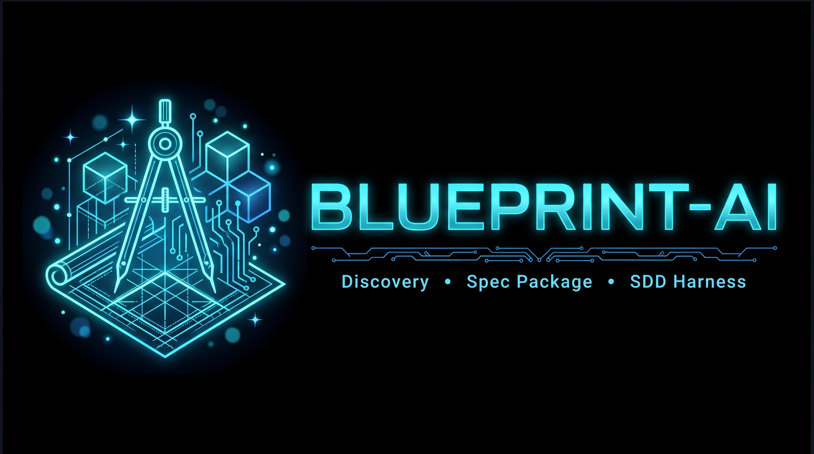

**Un pipeline multi-agente que convierte una conversación informal con un cliente en un conjunto estructurado y trazable de artefactos de ingeniería de software — y se lo entrega a cualquier motor de Spec-Driven Development (SDD).**

Hoy la mayoría del desarrollo agéntico se enfoca en generar código. BluePrint-IA trabaja la fase anterior: Discovery, PRD, Requisitos, Historias de Usuario, modelado UML/ERD, Estimación y una Propuesta Comercial — cada una es un skill de Claude Code que lee el estado confirmado de la etapa anterior y nunca inventa alcance, resoluciones ni números que no pueda trazar a una fuente.

## Pipeline

```
Conversación con el cliente
        ↓
  Discovery Agent
        ↓
    PRD Agent
        ↓
Requirements Agent
        ↓
User Stories Agent
        ↓
    UML Agent
        ↓
Estimation Agent
        ↓
 Proposal Agent
        ↓
Spec Package (congelado y versionado)
        ↓
   Harness (adaptador enchufable)
        ↓
 Motor SDD externo
```

BluePrint-IA es deliberadamente **independiente de cualquier motor SDD**. Su responsabilidad termina en el Spec Package congelado y versionado — conectar eso a un motor de desarrollo real (Gentle AI SDD, OpenSpec, o uno propio) es tarea del harness enchufable, así que cambiar de motor nunca toca este producto.

## Estructura del proyecto

```
.
├── .claude/skills/        # Los 10 skills del pipeline (Discovery → Proposal, más Orchestrator, Spec Package e Impact Analysis)
├── state/                 # Estado de máquina por etapa (*-state.json) — fuente de verdad, nunca el LLM
├── source/                # Documentos de trabajo legibles por humanos (prd.md, propuesta.md)
├── diagrams/               # Diagramas Mermaid generados (*.mmd)
├── spec-package/           # Entregable ensamblado determinísticamente — solo contenido confirmado, más manifest.json
├── prototype/              # Prototipo temprano del discovery-agent y su eval harness
├── own-product-test/       # Fixture end-to-end para el modo de trabajo `own_product`
├── assets/                 # Imágenes usadas en este README
└── AGENTS.md               # Registro de skills: frases disparadoras y rutas
```

## Principios de diseño clave

- **El LLM nunca es la fuente de verdad.** Cada etapa persiste un archivo `state/*.json` con un vocabulario de estado compartido (`confirmed`, `pending_clarification`, `blocked`, `rejected`), y las etapas siguientes solo construyen sobre ítems `confirmed`.
- **Las contradicciones se exponen, no se resuelven en silencio.** Discovery compara cada afirmación nueva contra todas las reglas confirmadas — sin importar qué stakeholder la dijo — y pregunta en vez de adivinar.
- **El alcance es un artefacto de primera clase.** El In-Scope/Out-of-Scope del PRD guía Requirements, la Propuesta y más adelante el Impact Analysis sobre pedidos de cambio — así el scope creep queda trazado y cotizado, no absorbido en silencio.
- **Dos modos de trabajo.** `client` entrevista a un stakeholder externo; `own_product` entrevista a un fundador sobre la hipótesis de su propio producto y aplica una postura más estricta de abogado del diablo sobre supuestos no validados.

## Skills

Ver [AGENTS.md](AGENTS.md) para el registro completo (frases disparadoras y rutas). Cada skill carga su propio `SKILL.md` bajo `.claude/skills/<nombre>/`.

| Etapa | Skill |
|---|---|
| 1. Discovery | `discovery-agent` |
| 2. PRD | `prd-agent` |
| 3. Requirements | `requirements-agent` |
| 4. User Stories | `user-stories-agent` |
| 5. UML/ERD | `uml-agent` |
| 6. Estimation | `estimation-agent` |
| 7. Proposal | `proposal-agent` |
| Transversales | `orchestrator-agent`, `spec-package-agent`, `impact-analysis-agent` |

## Estado

Todas las etapas del pipeline listadas arriba están implementadas. La capa de harness/adaptador enchufable que conecta el Spec Package con un motor SDD externo todavía no — no hay ningún motor SDD conectado todavía contra el cual construirla.
